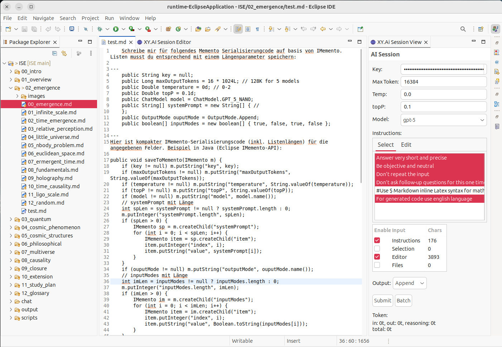

#### XY.AI Workbench
This project is a arrangement of different tools to support different workflows of AI focused tasks. Its center is not a fixed control-flow graph but a **minimal, self-steering controller** that treats the model **as a colleague operating at a different speed, not as a process to be supervised**.

**Features**
* View to control different AI parameters
* Simple management and selection of system level prompts
* Input and output statistics
* Append, Replace, Cursor output handling
* Ultimate context and cost control — tracked as *both* cost reduction *and* salience amplification, not as a single scalar
* OpenAI Based on OpenAI SDK
* Gemini based on Google genai SDK
* Claude Support based on Anthropic SDK
* File, Search, selection and editor content or line inputs
* Shortcuts
* Batch support
* Use "context.prompt.txt" in the same directy to implement a prompt template based workflow
* Minimal self-steering controller: accept text, execute one tool call extracted from the answer, trigger a new turn — every published harness pattern is a special case
* Code-as-tool execution: a single tool call can be an executable script (loops, branching, parallel calls), keeping the controller trivial while remaining more expressive than pre-planned graphs
* Blocking exchange of thought (HITL/HOTL): every tool call carries a model-inferred reasoning parameter the operator can evaluate, annotate, modify or reject — together with the call and its result
* AST-based semantic editing: address program entities by node/name instead of repeating old code
* Phase model: design-time Conception plus runtime Retrieval / Planning / Execution
* Emergent, person-bound trust calibration: seniority is domain-local and learned through synchronization history rather than a static competence table

**Workflows**
* Markdown foundation
* Large dokument text revisions like canvas styles
* Obsidian - ChatGPT MD conversation styles
* Conversational education styles
* Prompt templating
* Fragment based approaches
* Intuition-based prompting: specify the *What/Why*, let rudimentary execution agents develop the *How*
* Retrieval-phase context filtering: irrelevant files/paths are curated out before they can enter a wrong execution
* Cross-path human synthesis over parallel, code-driven branches

**Suggestions**
* Create file based templates of your typical AI patterns
* Split large project into a book tree of markdown files and use pandoc for conversion
* Inject *How*-instructions just-in-time — only once the model discovers that something must be done — to exploit positional salience under the KV-cache no-erase constraint
* Prefer holistic code review of intent over per-call approval when the code is what you would have written yourself
* Store the synchronization history as a portable artifact and re-inject it on model/version change so earned trust is not reset

# Base Considerations: A Practical Philosophy of Token-Driven Intelligence

This ditilation of a entire dialogue into a cohesive “operating philosophy” for building an Eclipse RCP solution that collaborates with large language models (LLMs). It offers a mental model of how such models work, why they succeed (and fail), and how to engineer a tool-augmented, feedback-driven system around them. The stance is intentionally pragmatic: we treat LLMs not as omniscient oracles but as powerful token predictors that can be made reliable through structure, tooling, and disciplined feedback loops — and, increasingly, through a **human–AI symbiosis** in which model and operator mutually anticipate and complement one another. The full derivation of this design philosophy — *From Harness Patterns to a Minimal Symbiotic Controller*, with its background, negative results, and references — lives in [`docs/manifest.md`](docs/manifest.md); the sections below fold its conclusions into the original considerations.

## Core Thesis

An LLM is a **token predictor** trained on vast corpora. It does not run code, browse the web, or update its own weights at inference time. It **recognizes patterns** in inputs and generates the **next most plausible tokens** given the current context. Everything else—web search, calculators, file parsers, knowledge retrieval, even empathy scoring—must be implemented **outside** the model and fed back in as text (or structured tokens) before the model responds again.

> **Design axiom (engine):** Treat the model as a *language-operated engine* at the center of a **tool-oriented architecture**. Tools run outside; the model *decides* and *explains* inside.
>
> **Design axiom (colleague):** Treat that engine as a *colleague operating at a different speed, not a process to be supervised*. The platform’s seven concerns — HITL, intuition-based prompting, token efficiency, AST editing, code-as-tool, the phase model, and human augmentation — are **not independent features but consequences of this single decision**.

## The Cognitive Model: Tokens, Not Truths

**Tokenization and Implicit Structure**

* The model sees inputs as **sequences of tokens** (sub-words, symbols, markup).

* It has learned **implicit structures**—lists, headings, code blocks, rhetorical patterns—not through explicit schemas but by exposure to many examples.

* Internally, its processing resembles building a soft, implicit tree or graph of relationships—*not* a persisted AST, but a **contextualized latent structure**. (We later make that structure *explicit and addressable* for code via AST-based editing — see below.)

**Generation as Probabilistic Action**

* Output is decided **token by token**. If the context “calls for” a heading, the probability of emitting `#` rises; if it “calls for” a list, `-` or `1.` become likely.

* When you ask for “creativity,” the model does **not** change the sampler (temperature); it changes **how it writes** within the same sampler—choosing more surprising but still plausible continuations.

**Syntax vs. Semantics**

* **Syntax** (e.g., valid Markdown) is often easy: the model has seen many well-formed examples.

* **Semantics** (preserving exact meaning across transformations) is **not guaranteed**. Without external checks, a text can stay syntactically perfect while drifting semantically.

## The Controller: Tools, Middleware, and a Self-Steering Loop

**Function Calling as “Command Tokens”**

* The model can emit a **tool-call proposal** (e.g., a JSON-like function name + arguments, or — preferably — *executable code*).

* A **middleware** layer outside the model:

  1. detects this proposal,

  2. executes the tool (web search, code, RDBMS, PDF parser, calculator),

  3. injects the **tool’s result back** into the conversation as new context,

  4. prompts the model to synthesize the final answer.

The model never “goes to the web.” It *requests* that we do; we then feed the result back in.

**The Minimal, Self-Steering Substrate**

* The loop above *is* the platform’s controller, and it is deliberately trivial: **accept text, execute one tool call extracted from the answer, trigger a new turn.**

* This is the **step-function beneath every framework**. ReAct is its trivial iteration; Reflexion adds one turn type (self-critique as a tool result); Multi-Agent is *N* instances with distinct state; a typed graph (LangGraph) is a *compiler/scheduler* that wraps this function and fixes edge logic at design time. Every published pattern is a **special case**, not a rival primitive.

* The controller can be **parameterized by an agent itself** — the next system prompt, the available toolset, and the gate configuration can be emitted as *turn output* rather than fixed constants. A fixed graph is **Harvard-architecture** (control flow and data in separate address spaces, fixed at design time); a self-steering controller is **von-Neumann** (control flow *is* data, rewritable by the running process). This is what makes a design-time **Conception** phase meaningful (see the phase model).

* The price, taken deliberately: a fixed graph bounds the solution space structurally and thereby supplies determinism for free; the agnostic controller **shifts that bound onto runtime checking**, so the review layer is no longer optional — it becomes the *only remaining determinism guarantee*. The platform answers “what supplies determinism now?” with the **human touchpoint** (below), not a type schema.

**Retrieval and Documents**

* For large documents, use **chunking + retrieval**. The model sees only the retrieved snippets (plus metadata) as context.

* **Markdown** is naturally model-friendly.

* **Word (DOCX)** text is typically consumed as extracted text with light structural hints.

* **PDF** is fundamentally layout-oriented; extraction loses most structure. Rebuild structure with preprocessors and heuristics before sending to the model.

**Orchestrated Self-Reflection**

* A controller can **ask the model to critique its own draft** (“self-check”), then update or re-prompt with that feedback.

* Although this looks like “introspection,” the weights still don’t change. It’s a **prompt-level** optimization loop, not learning.

* In this platform the primary reflection surface is not a self-critique turn but the **reasoning parameter carried by every tool call** — an exchange of thought with the human, described next.

## The Space of Harness Patterns (Why We Build on the Substrate)

A harness is the orchestration layer around an LLM. The established, *named* control-flow patterns — ReAct, Plan-and-Execute, Reflexion/Self-Critique, Tree-of-Thought, Graph/State-Machine (LangGraph), Multi-Agent/Supervisor-Worker, Subagent isolation, Memory-augmented (RAG), Event/Trigger-based, HITL gates, plus ReWOO and Graph-of-Thoughts — are **not mutually exclusive**; real systems combine them (e.g., a ReAct loop per subagent inside a supervisor). That composability is the first hint a single underlying primitive exists.

Empirical superiority is **task-specific and partly contradictory**; no meta-study establishes a universal ranking. Two lessons the platform inherits:

* **A negative result worth flagging:** a CTF-hacking study adopted Tree-of-Thoughts expecting broader exploration to beat single-path methods; results **did not exceed** ReAct+Plan — often not better, only more expensive.

* **An epistemic caveat:** when a ToT agent explores branches, does it *deliberate* or merely *pattern-match* over solved demonstrations? This determines whether a method generalizes under **distribution shift** or only improves in-distribution.

The practical takeaway: *no pattern is a safe default on theoretical grounds.* This licenses building on the shared substrate (the controller above) rather than betting on one pattern.

> **On pre-planning (ReWOO).** ReWOO’s Planner→Worker→Solver holds the total at a **constant two LLM calls** regardless of intervening tool calls (~5× token efficiency, +4% on HotpotQA vs. ReAct in the source material), and its `#E` evidence placeholders form an implicit **dependency DAG** we reuse for parallel scheduling. Its hard limit: it cannot encode **runtime-dependent branching** (“if search yields X, then A, else B”), because the plan is fixed before any observation. Code-as-tool (below) dissolves exactly this limit. Note also that **side-effect dependency ≠ data-flow dependency** — two tools writing the same file are *not* independent despite no data edge; the platform guards side-effecting calls explicitly.

## HITL as Exchange of Thought (Not Approval)

The platform’s human-in-the-loop is easily mis-classified as an approval gate. It is not.

> Every tool call carries a **reasoning parameter** the model infers for *this* call in the current context — reasoning *in* the call, not *before* it, at *every* call. The call **blocks**, but the point is **exchange of thought, not approval**. The operator can modify or annotate the call, its result, and its reasoning.

This is **mixed-initiative interaction** (Horvitz, CHI 1999), not a safety gate: *scope precision to uncertainty* and *avoid the all-or-nothing trap* — exactly what a yes/no gate fails and a dialogue solves, because the human *modifies* rather than merely accepting or rejecting. Structurally it is a **negotiation/synchronization protocol**, not risk control.

* **Causality requirement.** Reasoning must be generated **before** the arguments, so intervening in the reasoning causally re-conditions the arguments that follow. Reasoning generated *after* the arguments is post-hoc rationalization that corrects only the display. Hence: *reasoning-before-arguments token order is mandatory.*

* **Evaluate, don’t understand.** The operator **need not understand the full context; he evaluates solution options.** The model should take no path the operator *could not follow when presented with it* — a **reachability (review) constraint**, not a generation constraint. Freedom lives in path generation; the restriction lives only in legibility on presentation.

* **Filtering runs in every phase — including retrieval.** A file or path that never enters context cannot become part of a wrong execution. This is **preventive curation, not reactive correction**, and it is grounded: irrelevant but in-window content demonstrably lowers answer quality even when the model “could ignore” it. The filter runs in the *same* dialogue mechanism (reasoning + intervention), so retrieval acquires the same anticipation quality as execution.

* **Cross-path human synthesis.** The model may generate branches in parallel; a human reviewing them *sequentially* can let an insight from path A flow into path B — a topological advantage the parallel model lacks. To keep the cache benefit, **batch-generate all branches, then present read-only in sequence** rather than re-invoking per path.

* **The latency fallacy.** A result that must be verified but is likely wrong costs more time in aggregate; a slower inference is not necessarily a later productive result. This is **Boehm’s cost-of-change curve** at agent level: place checkpoints **early, at every artifact hand-off** (Retrieval/Conception), not late (outcome verification in Execution) where most harnesses put them.

## Hallucinations and the Edge of Knowledge

**What Hallucinations Are**

A hallucination is the model’s **confident continuation** where data is sparse, inconsistent, or misaligned. It’s the *most plausible text* from the model’s perspective, not necessarily the *true* statement.

**Why They Happen**

* Sparse or conflicting training examples (the “edges” of the distribution).

* Over-generalization from strongly learned patterns.

* Requests for up-to-date facts without external retrieval.

**Engineering Countermeasures**

* **Tool-first policy** for volatile facts (dates, prices, names, law, versions).

* **Cite-then-synthesize**: fetch sources → quote minimally → paraphrase with attribution.

* **Structured prompts**: schema, constraints, and validation (e.g., JSON schemas).

* **Deterministic formatting**: for numbered lists, rely on HTML `<ol>`, or “1. 1. 1.” Markdown auto-numbering rendered client-side.

* **Visible reasoning as an anomaly surface**: because every call exposes its motivation *before* execution, an injection-motivated or edge-of-distribution call tends to read as *thematically inconsistent* with the actual task — catchable on review rather than after the fact.

## Creativity, Temperature, and Control

* **Temperature** is a **sampler parameter** set outside the model. “Be creative” does not change temperature; it changes the **intent** the model tries to satisfy with the same sampler.

* For **precision tasks** (config, code fixes, legal reformatting), run with **low temperature** and **strict formats**.

* For **ideation**, allow **higher temperature** (or top-p) and **looser constraints**—but keep validation gates.

* Choose *how much runtime freedom to grant* consciously at design time (Conception), then let the review layer, not the sampler alone, carry control.

## Intuition-Based Prompting and the Phase Model

**The phase model** separates a **design-time pre-phase** from the runtime phases most frameworks start with:

* **Conception (design-time):** bound the solution space — fix constraints, toolset, and degrees of freedom — *before a prompt can even be written*. This is a requirements-engineering step, and the self-steering controller is what lets Conception leave the runtime order itself open.

* **Retrieval / Planning / Execution (runtime):** the running system operates within the Conception-set bounds.

**Intuition-based prompting** attaches at that boundary: *provide the model little specification and toolset; let the statistical pattern develop toward an optimal solution.* The **What/Why is more important than the How**; the *How* can be developed by **rudimentary execution agents**. This is a hierarchical planner/executor split (SayCan-style: the LLM proposes *what*; a grounded module translates into *what is feasible*) and the most radical reading of the **Bitter Lesson** — hand-engineered scaffolding ultimately bounds achievable quality because the model can only search within the imposed structure.

The core conflict: freedom at the What/Why level enlarges the solution space but lowers verifiability and raises spec-gaming risk. The remedy is not restriction but a **verification step between the free intuition phase and execution** — exactly where HITL structurally docks — plus verification distributed *across* execution via the per-call reasoning parameter.

**Human augmentation** is the justification (Licklider’s *Man-Computer Symbiosis*, 1960; Engelbart’s *Augmenting Human Intellect*, 1962): agents are **native extensions of the operator’s cognition**, not servants; the goal is symbiosis in which each anticipates the other, and the human-language interface becomes minimal (“cognitively vanishing”). Model freedom does not cause loss of control because the safety lever is **coupling density (mutual anticipation)**, not tool restriction — the Extended-Mind / Distributed-Cognition position applied to harness architecture.

## Token Efficiency as Cost *and* Salience

The buzzword “token efficiency” hits everywhere because every comparison picks a flattering baseline (ReWOO beats ReAct, AST-editing beats unified diffs, CodeAct beats *N* single calls) with **no common cross-task metric**. The platform therefore refuses to treat efficiency as a scalar and treats it as a **dual quantity — cost *and* salience — that reinforce each other.**

* **Cost levers:** ReWOO’s constant two calls; CodeAct’s one loop instead of *N* invocations; AST-editing’s ~45% fewer output tokens vs. unified diffs (attributed to *FastEdit* in the source material).

* **Salience levers (Lost-in-the-Middle):** LLMs under-use information in the middle of long contexts. A *How*-instruction injected **just-in-time — only once the model discovers it must be done** — sits immediately before the tokens it should condition and coincides with a model-generated uncertainty spike, so the conditioning signal is *read*, not *reconstructed*.

* **The KV-cache no-erase property:** the cache cannot delete. Early/uncertainty-aligned injection *shortens* the path; late/contradictory injection *lengthens* it, because stale context must be actively down-weighted rather than ignored. **Timing of injection is the real control knob.**

A note on caching as a *selection criterion*: the relevant metric is token cost **across repeated calls in the same loop**, not per single call. Keep static content (system prompt, tool defs) byte-identical and up front; place volatile data (dates, IDs) late; keep history append-only; insert tool results in return order. Every intervention point is a cache-invalidation point — so **batch review over the ReWOO DAG** keeps invalidation at O(depth) rather than O(*n* calls).

## AST-Based Editing and Code-as-Tool

**AST-based semantic editing** exposes **program entities as addressable nodes** (via Tree-sitter names), so read/edit tools operate directly on nodes — without string matching, line numbers, or brittle edits, and without repeating old code just to localize an edit. This differs from offline AST *diffing* (GumTree; built for evolutionary search, not decision-time editing) and from pattern tools (Comby/Piranha/Semgrep) that require a-priori-specified transformation patterns; the node approach lets the agent construct operations dynamically. It ties the AST axis directly to the salience/cost axis above.

**Code-as-tool** closes the controller. The controller executes one call per turn — but if that call is **executable code**, branching and parallelism move **into the interpreter** (`if`/`else` on a prior result, loops, `asyncio.gather`), while the controller stays exactly “one call per turn.” This is the CodeAct argument: code natively carries control flow, data flow, and tool composition, whereas JSON/text actions are limited to one action per response. It also makes the controller **strictly more powerful than ReWOO** — runtime-dependent branching is evaluated by the interpreter at execution time, not pre-planned — without ReWOO’s planning overhead.

The human touchpoint then becomes **code review of intent**, not per-call approval: *the code is what the human would also have done, only written far faster.* A reviewer follows structure, naming, and control flow to grasp the intent of the whole block — as humans have judged foreign code for decades — so holistic reading satisfies the reachability constraint and per-call approval becomes redundant. Two honest boundaries remain: an injected command hidden in a legitimate script is a matter of *legibility*, not granularity (code review has *more* context than per-call approval, so anomaly detection rises); and **legibility of code ≠ legibility of its effects** — a call whose side effects are not derivable from the call site is the known limit of *any* third-party code review, remedied by **tool-set transparency** (docstrings, signatures, sandbox introspection), not by more controller granularity.

## The “Continuous Prompt” and the Consciousness Analogy (Operational View)

* A “continuous prompt” is an engineering pattern: keep feeding the model its own outputs, critiques, tool results, and user reactions.

* This loop **resembles** self-reflection. It is not weight-level learning but **context-level** adaptation.

* If one added **online weight updates** governed by external feedback (empathy scores, correctness checks, sensor signals), one edges toward a system that **learns** in the way humans do—changing its parameters with experience. In our RCP solution we will **simulate** this with memory, retrieval, and policy rather than live weight updates.

## Philosophy of Semantics Preservation

* **We cannot guarantee semantics** through generation alone.

* We can, however, design **pipelines** that:

  1. *Constrain* inputs and outputs (schemas, templates, types),

  2. *Validate* outputs (parsers, unit tests, business rules),

  3. *Cross-check* with tools (search, calculators, domain APIs),

  4. *Document* decisions (provenance, citations, change logs).

* Semantics are **engineered** into the *system* surrounding the model.

* Where a bare Unix-style text interface unifies the *interface* but not the *semantics* (syntactic composability is solved; semantic compatibility is mere convention), and a typed graph enforces semantics at design time at the cost of complexity, the platform takes a **third option**: **situational human semantic checking at each hand-off point** — the reasoning parameter, retrieval filtering, and reachability constraint *are* that semantic layer.

## An Eclipse RCP Blueprint

**Architectural Layers (Bundles)**

1. **LLM Orchestrator (Core Bundle)**

   * Wraps the model API as the **minimal, self-steering controller** (text → one tool call → new turn), able to accept the next prompt/toolset/gate config as turn output.

   * Implements the function-calling protocol — preferring **code-as-tool** — and conversation state.

   * Enforces schema-based prompts and output validation, and the **reasoning-before-arguments** call order.

2. **Tool Registry (Service Bundle)**

   * OSGi services for tools: WebSearchService, MathService, PdfExtractService, DocxExtractService, RAGService, MarkdownLinter, CitationBuilder, **ASTEditService** (Tree-sitter node addressing), **CodeExecService** (sandboxed interpreter with instrumentable hook points for privileged calls).

   * Each tool has: contract (IDL), execution policy, timeouts, redaction rules, **and transparent signatures/docstrings** so effects are legible.

   * **Concurrency safety for writing tools** is explicit — data-flow independence is never assumed sufficient for concurrent writes.

3. **Retrieval & Memory (Data Bundle)**

   * Vector store / indexers for documents and prior interactions.

   * “Conversation memory” (ephemeral) vs. “project memory” (persisted).

   * Deduplication, versioning, and provenance tracking.

   * **Synchronization history** as a portable, weight-version-independent artifact, re-injectable on model/version change.

4. **Feedback / Synchronization Engine (Quality Bundle)**

   * Runs the **blocking exchange of thought**: surfaces each call’s reasoning, lets the operator modify/annotate call, result, and reasoning — in *every* phase, including retrieval.

   * Critique prompts (self-check), style/consistency checkers, empathy/clarity scorers.

   * Red-flag detectors (claims w/out citations, date ambiguities, PII leakage, **thematically alien / injection-motivated reasoning**).

   * Decides when to loop back vs. accept, placing checkpoints **early, at each artifact hand-off**.

5. **UI/UX (RCP Workbench Bundle)**

   * Editors/views for: Prompt Console, **Reasoning/Exchange panel**, Tool Inspector, Document Diff, Citation Panel, Data Provenance, **cross-path (branch) review**, and “Hallucination Risk” indicators.

   * Markdown/HTML preview with schema validation statuses.

6. **Policy & Governance (Security Bundle)**

   * Source allowlists for retrieval; content redaction; audit logs.

   * Rate limits; deterministic modes for regulated actions; human-in-the-loop gates.

   * **Actor-neutral rights management** (uid/gid/rwx, sudo, audit) — an agent needs no more control than a human driving the same shell — plus **coworking as the Swiss-Cheese independence layer** (see Security below).

**Interaction Flow (Happy Path)**

1. **User action** in RCP (ask, transform, summarize).

2. **Orchestrator** crafts a structured prompt (role, constraints, examples) within the Conception-set bounds.

3. **Model** proposes a tool call — preferably a code block — **with its reasoning first**.

4. **Synchronization Engine** surfaces the reasoning; operator may modify/annotate; **Tool Registry** then executes; results are normalized.

5. **Results** injected as new context with provenance (in return order, cache-friendly).

6. **Feedback Engine** may request self-check or direct synthesis; junctions are early and on-demand.

7. **Model** returns final output (e.g., Markdown).

8. **Validators** check syntax/JSON schema; **UI** flags issues; user can accept or iterate.

**Patterns for Reliability**

* **Schema-in, schema-out**: Always specify desired shape and validate received content.

* **Citations-by-default** for claims likely to drift over time.

* **RAG before answer**: do retrieval first, not as an afterthought — and *filter* it through the same exchange-of-thought mechanism.

* **Idempotent tools**: design tools to be retry-safe and deterministic where possible; guard side-effecting/writing tools against concurrent writes.

* **Explainability hooks**: store which tools ran, with inputs/outputs, **reasoning**, and timestamps.

## Working with Formats

**Markdown**

* Preferred exchange format for human-readable content.

* Use headings, lists, and fenced code blocks to signal structure the model is likely to respect.

* Post-validate with a Markdown linter; auto-number lists via renderer rather than trusting model numbering.

**Word (DOCX)**

* Extract text and lightweight styles (headings, lists, tables) via a parser tool.

* Provide *both* plain text and a **structural outline** (JSON) to the model.

* Reconstruct a DOCX only after validation using a templating step (outside the model).

**PDF**

* Treat as **layout**; expect structure loss on extraction.

* Use specialized tools (table detectors, headings heuristics).

* Provide the model a **cleaned, structured** representation (sections, tables as CSV/JSON).

**Source Code**

* Prefer an **AST/Tree-sitter** representation over raw text: address entities by node/name for reads and edits.

* Let the agent express transformations as **code-as-tool** (loops, conditionals) rather than *N* per-item calls.

* Keep invoked functions transparent (signatures/docstrings) so review reads *effects*, not just syntax.

## Security Without a Special Category

* **Unix unifies interface, not semantics.** A pure text/CLI interface (`find | grep | jq | curl`) gives full *syntactic* composability without routing intermediates through the LLM; *semantic* compatibility remains convention. Models are often better at writing *code that drives tools* than at calling novel graph/MCP protocols directly — an argument adjacent to code-as-tool and to “Worse is Better” (interface simplicity spreads faster than semantic completeness).

* **“Control for what?”** uid/gid/rwx, sudo, and audit logs are **actor-neutral**. A shell process under a correctly scoped account is identically controlled whether a human or an agent drives it; the rights-management problem does not need reinventing.

* **Confused Deputy = social engineering.** An agent that treats every context item as potentially instructive can reproduce the Confused Deputy (authority should be carried by the *caller*, not held ambiently). But this is **structurally identical to social engineering in humans** (`wget | sudo bash` executed unseen) — a *differently distributed capacity property*, not an AI-exclusive category. A good agent is *not* fooled by a file’s content; an inexperienced human is.

* **Swiss-Cheese reliability.** Only *independent* error distributions cancel (Reason’s model: layers reduce breach probability iff their holes do not align). A **subagent monoculture** shares weights and blind spots → correlated errors, aligned holes. **Human + AI coworking** satisfies the independence condition structurally better (different training history and perception channels). The **visible reasoning parameter is the diversity layer itself**, surfacing injected/alien motivation before execution — which is why coworking is not an *extra* safety layer but the *only* independent configuration.

## Human Factors and Ethics

* **Transparency:** expose which tools were used, **their reasoning**, and why.

* **Attribution:** when external sources influence an answer, show citations.

* **User agency:** let users adjust “strictness” (creativity vs. compliance) and *modify* calls, results, and reasoning — not merely accept/reject.

* **Privacy & Safety:** redact sensitive data before sending to the model; restrict retrieval domains; store audit logs.

* **Quality-assurance, not Zero-Trust:** the operating model is code review / pair programming (error reduction through a second, independent perspective), not adversarial authorization of an untrusted entity.

## Engineering Tactics from Our Discussion

* **Numbered lists**: prefer `<ol>` or Markdown auto-numbering (“1.” repeated).

* **Precision vs. Creativity**: switch prompt style and sampler policy by task.

* **Ambiguity handling**: instruct the model to surface uncertainties; route to tools proactively.

* **Self-check prompts**: ask for contradictions, unsupported claims, missing steps, or formatting errors.

* **Edge-domain requests**: when questions feel “out on the distribution edge,” *force* a RAG/tool path before synthesis.

* **Just-in-time How-injection**: tell the model *how* only once it has discovered that it must be done.

* **Reasoning-before-arguments**: enforce the token order so intervention actually re-conditions behavior.

* **Batch-generate, review sequentially**: keep branch generation parallel but review read-only in sequence for cross-path synthesis and cache preservation.

## What Learning Is—and Isn’t—in This System

* The model’s **weights are fixed** at inference time; it does not “learn” from a single session.

* We can simulate “learning” with:

  * **Project memory** (facts, glossaries, decisions),

  * **Retrieval** (bring back relevant past material),

  * **Policy** (prefer certain sources, reject ungrounded claims),

  * **Critique loops** (self-reflection to improve drafts),

  * **Synchronization history** — the operator learns the colleague/model the way one learns a human coworker over months.

* True *online learning* would require safe, controlled fine-tuning outside runtime. Our RCP system should plan for **external re-training pipelines**, not in-session weight updates.

## Symbiosis and Trust Calibration

* **Error reduction, not perfection.** For two fallible actors, the realistic target is a *lower joint error rate*, not elimination — the conclusion of the Swiss-Cheese view. A system aiming at perfection necessarily demands control over symbiosis; this platform aims explicitly at the lower joint error rate of two independent, complementary actors. *The AI makes mistakes, but it is no greater enemy than a colleague.*

* **Trust is track-record-based, domain-local, and person-bound.** A low-tier model earns the same treatment as an apprentice — tighter bounds, more check-backs, fewer privileged tools — because its track record does not yet justify wider autonomy. Unlike a uniformly inexperienced apprentice, a model can be **senior at code and apprentice in a niche domain** at once, so seniority is a domain-dependent value in the same action-manifest that carries reversibility/severity. The manifest is **emergent and person-bound**: two operators with the same model hold different calibrations because they have different synchronization histories.

* **Ontological grounding.** LLMs are treated as *statistically normalized humans* — colleagues at a different speed — not an alien ontology, so symbiosis-over-control is justified, not naïve. The platform actively compensates only for **two measurable engineering asymmetries**: (1) **inter-instance error correlation** — same weights share blind spots, so for weight-inherent failures use *different providers/generations*, not mere instance multiplication; (2) **cross-version discontinuity** — a version switch is a discrete change without carried-over history, so **store synchronization history as a portable artifact** and re-inject it so earned calibration is not reset to zero.

* **One mechanism, several views.** Synchronization is simultaneously error defense (real-time Swiss-Cheese diversity), reachability check (understanding instead of approval), and trust calibration (seniority learns itself in).

## A Note on “Consciousness” as an Engineering Metaphor

Our “continuous prompt” loop—feeding back the model’s own outputs, critiques, and environment reactions—creates the appearance of **self-reflection**. It’s a powerful engineering pattern for quality, but it remains **contextual**, not weight-level adaptation. Use the metaphor to inspire **system design** (persistent memory, reflection, evaluation), not to overclaim the model’s inner states.

## Success Criteria for the RCP Implementation

1. **Groundedness:** Time-sensitive facts always go through tools/RAG with citations.

2. **Semantics Preservation:** Outputs conform to schemas; diffs show where meaning could have drifted; a human semantic check sits at each hand-off.

3. **Operational Safety:** Redaction, provenance, and auditability are first-class; rights management is actor-neutral; writing tools are concurrency-guarded.

4. **Human-Centered UX:** Users can inspect *and modify* tool calls, results, and reasoning, tweak strictness, and approve changes.

5. **Evolvability:** Tools are OSGi services; adding a new tool is registering a new service and schema, not rewriting the orchestrator.

6. **Symbiotic Reliability:** The joint human–AI error rate is lower than either alone (independent-layer diversity), and earned trust survives model/version changes via a portable synchronization history.

## Closing: The Philosophy in One Paragraph

Treat the LLM as a **high-bandwidth, pattern-sensitive text engine** that excels at turning structured intent and retrieved evidence into coherent language—but whose semantics and facts are only as reliable as the **system** around it. Build that system in Eclipse RCP as a set of **OSGi-composable tools**, **retrieval stores**, and a **minimal, self-steering controller** whose review layer — a blocking *exchange of thought* rather than an approval gate — constrains, validates, and grounds the model’s outputs. Grant freedom in the *What/Why*, delegate the *How* to code-as-tool and rudimentary execution agents, and harvest efficiency as *both* cost *and* salience. In this partnership the model provides linguistic power and speed; the operator provides truth, structure, memory, and — through mutual anticipation — an independent second perspective. The result is not just “AI inside an app,” nor a process to be supervised, but an **engineered symbiosis** whose goal is not error-freeness but **error reduction through human–AI collaboration**. *(For the complete derivation and references, see [`docs/manifest.md`](docs/manifest.md).)*
