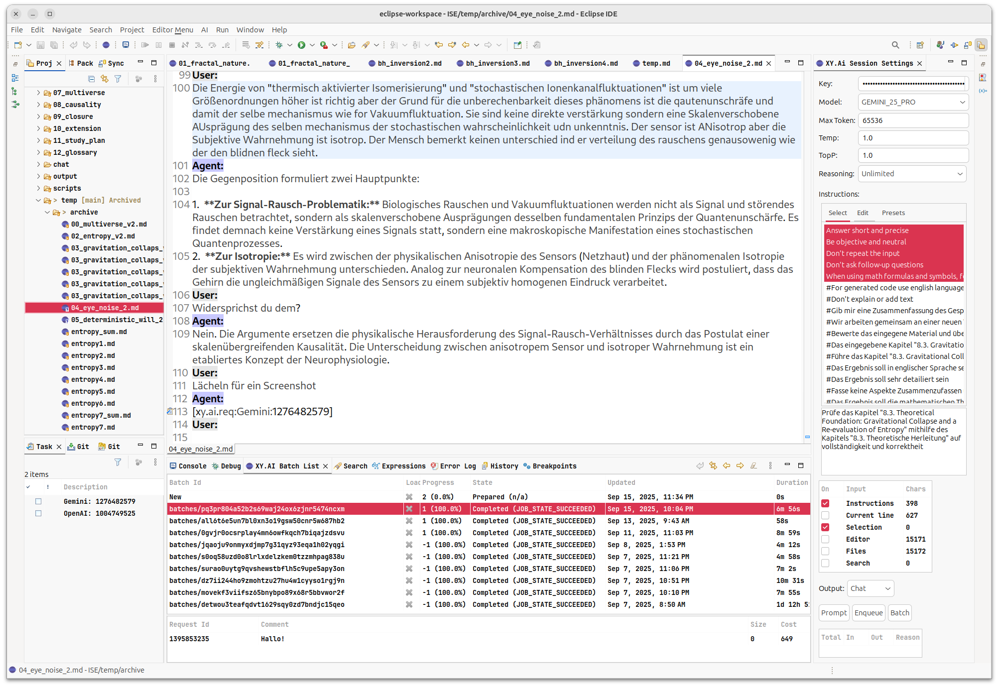

#### XY.AI Workbench
This project is a arrangement of different tools to support different workflows of AI focused tasks.

**Features**
* View to control different AI parameters
* Simple management and selection of system level prompts
* Input and output statistics
* Append, Replace, Cursor output handling
* Ultimate context and cost control
* OpenAI Based on OpenAI SDK
* Gemini based on Google genai SDK
* File, Search, selection and editor content or line inputs
* Shortcuts
* Batch support

**Workflows**
* Markdown foundation
* Large dokument text revisions like canvas styles
* Obsidian - ChatGPT MD conversation styles
* Basic conversational education styles
* Fragment based approaches

**Suggestions**
* Create file based templates of your typical AI patterns
* Split large project into a book tree of markdown files and use pandoc for conversion

# Base Considerations: A Practical Philosophy of Token-Driven Intelligence

This ditilation of a entire dialogue into a cohesive “operating philosophy” for building an Eclipse RCP solution that collaborates with large language models (LLMs). It offers a mental model of how such models work, why they succeed (and fail), and how to engineer a tool-augmented, feedback-driven system around them. The stance is intentionally pragmatic: we treat LLMs not as omniscient oracles but as powerful token predictors that can be made reliable through structure, tooling, and disciplined feedback loops.

## Core Thesis

An LLM is a **token predictor** trained on vast corpora. It does not run code, browse the web, or update its own weights at inference time. It **recognizes patterns** in inputs and generates the **next most plausible tokens** given the current context. Everything else—web search, calculators, file parsers, knowledge retrieval, even empathy scoring—must be implemented **outside** the model and fed back in as text (or structured tokens) before the model responds again.

> **Design axiom:** Treat the model as a *language-operated engine* at the center of a **tool-oriented architecture**. Tools run outside; the model *decides* and *explains* inside.

## The Cognitive Model: Tokens, Not Truths

**Tokenization and Implicit Structure**

* The model sees inputs as **sequences of tokens** (sub-words, symbols, markup).

* It has learned **implicit structures**—lists, headings, code blocks, rhetorical patterns—not through explicit schemas but by exposure to many examples.

* Internally, its processing resembles building a soft, implicit tree or graph of relationships—*not* a persisted AST, but a **contextualized latent structure**.

**Generation as Probabilistic Action**

* Output is decided **token by token**. If the context “calls for” a heading, the probability of emitting `#` rises; if it “calls for” a list, `-` or `1.` become likely.

* When you ask for “creativity,” the model does **not** change the sampler (temperature); it changes **how it writes** within the same sampler—choosing more surprising but still plausible continuations.

**Syntax vs. Semantics**

* **Syntax** (e.g., valid Markdown) is often easy: the model has seen many well-formed examples.

* **Semantics** (preserving exact meaning across transformations) is **not guaranteed**. Without external checks, a text can stay syntactically perfect while drifting semantically.

## Tools, Middleware, and the Two-Phase Loop

**Function Calling as “Command Tokens”**

* The model can emit a **tool-call proposal** (e.g., a JSON-like function name + arguments).

* A **middleware** layer outside the model:

  1. detects this proposal,

  2. executes the tool (web search, code, RDBMS, PDF parser, calculator),

  3. injects the **tool’s result back** into the conversation as new context,

  4. prompts the model to synthesize the final answer.

The model never “goes to the web.” It *requests* that we do; we then feed the result back in.

**Retrieval and Documents**

* For large documents, use **chunking + retrieval**. The model sees only the retrieved snippets (plus metadata) as context.

* **Markdown** is naturally model-friendly.

* **Word (DOCX)** text is typically consumed as extracted text with light structural hints.

* **PDF** is fundamentally layout-oriented; extraction loses most structure. Rebuild structure with preprocessors and heuristics before sending to the model.

**Orchestrated Self-Reflection**

* A controller can **ask the model to critique its own draft** (“self-check”), then update or re-prompt with that feedback.

* Although this looks like “introspection,” the weights still don’t change. It’s a **prompt-level** optimization loop, not learning.

## Hallucinations and the Edge of Knowledge

**What Hallucinations Are**

A hallucination is the model’s **confident continuation** where data is sparse, inconsistent, or misaligned. It’s the *most plausible text* from the model’s perspective, not necessarily the *true* statement.

**Why They Happen**

* Sparse or conflicting training examples (the “edges” of the distribution).

* Over-generalization from strongly learned patterns.

* Requests for up-to-date facts without external retrieval.

**Engineering Countermeasures**

* **Tool-first policy** for volatile facts (dates, prices, names, law, versions).

* **Cite-then-synthesize**: fetch sources → quote minimally → paraphrase with attribution.

* **Structured prompts**: schema, constraints, and validation (e.g., JSON schemas).

* **Deterministic formatting**: for numbered lists, rely on HTML `<ol>`, or “1. 1. 1.” Markdown auto-numbering rendered client-side.

## Creativity, Temperature, and Control

* **Temperature** is a **sampler parameter** set outside the model. “Be creative” does not change temperature; it changes the **intent** the model tries to satisfy with the same sampler.

* For **precision tasks** (config, code fixes, legal reformatting), run with **low temperature** and **strict formats**.

* For **ideation**, allow **higher temperature** (or top-p) and **looser constraints**—but keep validation gates.

## The “Continuous Prompt” and the Consciousness Analogy (Operational View)

* A “continuous prompt” is an engineering pattern: keep feeding the model its own outputs, critiques, tool results, and user reactions.

* This loop **resembles** self-reflection. It is not weight-level learning but **context-level** adaptation.

* If one added **online weight updates** governed by external feedback (empathy scores, correctness checks, sensor signals), one edges toward a system that **learns** in the way humans do—changing its parameters with experience. In our RCP solution we will **simulate** this with memory, retrieval, and policy rather than live weight updates.

## Philosophy of Semantics Preservation

* **We cannot guarantee semantics** through generation alone.

* We can, however, design **pipelines** that:

  1. *Constrain* inputs and outputs (schemas, templates, types),

  2. *Validate* outputs (parsers, unit tests, business rules),

  3. *Cross-check* with tools (search, calculators, domain APIs),

  4. *Document* decisions (provenance, citations, change logs).

* Semantics are **engineered** into the *system* surrounding the model.

## An Eclipse RCP Blueprint

**Architectural Layers (Bundles)**

1. **LLM Orchestrator (Core Bundle)**

   * Wraps the model API.

   * Implements function-calling protocol and conversation state.

   * Enforces schema-based prompts and output validation.

2. **Tool Registry (Service Bundle)**

   * OSGi services for tools: WebSearchService, MathService, PdfExtractService, DocxExtractService, RAGService, MarkdownLinter, CitationBuilder.

   * Each tool has: contract (IDL), execution policy, timeouts, redaction rules.

3. **Retrieval & Memory (Data Bundle)**

   * Vector store / indexers for documents and prior interactions.

   * “Conversation memory” (ephemeral) vs. “project memory” (persisted).

   * Deduplication, versioning, and provenance tracking.

4. **Feedback Engine (Quality Bundle)**

   * Critique prompts (self-check), style/consistency checkers, empathy/clarity scorers.

   * Red-flag detectors (claims w/out citations, date ambiguities, PII leakage).

   * Decides when to loop back vs. accept an answer.

5. **UI/UX (RCP Workbench Bundle)**

   * Editors/views for: Prompt Console, Tool Inspector, Document Diff, Citation Panel, Data Provenance, and “Hallucination Risk” indicators.

   * Markdown/HTML preview with schema validation statuses.

6. **Policy & Governance (Security Bundle)**

   * Source allowlists for retrieval; content redaction; audit logs.

   * Rate limits; deterministic modes for regulated actions; human-in-the-loop gates.

**Interaction Flow (Happy Path)**

1. **User action** in RCP (ask, transform, summarize).

2. **Orchestrator** crafts a structured prompt (role, constraints, examples).

3. **Model** proposes a tool call (e.g., `search(query=...)`).

4. **Tool Registry** executes the call; results are normalized.

5. **Results** injected as new context with provenance.

6. **Feedback Engine** may request self-check or direct synthesis.

7. **Model** returns final output (e.g., Markdown).

8. **Validators** check syntax/JSON schema; **UI** flags issues; user can accept or iterate.

**Patterns for Reliability**

* **Schema-in, schema-out**: Always specify desired shape and validate received content.

* **Citations-by-default** for claims likely to drift over time.

* **RAG before answer**: do retrieval first, not as an afterthought.

* **Idempotent tools**: design tools to be retry-safe and deterministic where possible.

* **Explainability hooks**: store which tools ran, with inputs/outputs and timestamps.

## Working with Formats

**Markdown**

* Preferred exchange format for human-readable content.

* Use headings, lists, and fenced code blocks to signal structure the model is likely to respect.

* Post-validate with a Markdown linter; auto-number lists via renderer rather than trusting model numbering.

**Word (DOCX)**

* Extract text and lightweight styles (headings, lists, tables) via a parser tool.

* Provide *both* plain text and a **structural outline** (JSON) to the model.

* Reconstruct a DOCX only after validation using a templating step (outside the model).

**PDF**

* Treat as **layout**; expect structure loss on extraction.

* Use specialized tools (table detectors, headings heuristics).

* Provide the model a **cleaned, structured** representation (sections, tables as CSV/JSON).

## Human Factors and Ethics

* **Transparency:** expose which tools were used and why.

* **Attribution:** when external sources influence an answer, show citations.

* **User agency:** let users adjust “strictness” (creativity vs. compliance).

* **Privacy & Safety:** redact sensitive data before sending to the model; restrict retrieval domains; store audit logs.

## Engineering Tactics from Our Discussion

* **Numbered lists**: prefer `<ol>` or Markdown auto-numbering (“1.” repeated).

* **Precision vs. Creativity**: switch prompt style and sampler policy by task.

* **Ambiguity handling**: instruct the model to surface uncertainties; route to tools proactively.

* **Self-check prompts**: ask for contradictions, unsupported claims, missing steps, or formatting errors.

* **Edge-domain requests**: when questions feel “out on the distribution edge,” *force* a RAG/tool path before synthesis.

## What Learning Is—and Isn’t—in This System

* The model’s **weights are fixed** at inference time; it does not “learn” from a single session.

* We can simulate “learning” with:

  * **Project memory** (facts, glossaries, decisions),

  * **Retrieval** (bring back relevant past material),

  * **Policy** (prefer certain sources, reject ungrounded claims),

  * **Critique loops** (self-reflection to improve drafts).

* True *online learning* would require safe, controlled fine-tuning outside runtime. Our RCP system should plan for **external re-training pipelines**, not in-session weight updates.

## A Note on “Consciousness” as an Engineering Metaphor

Our “continuous prompt” loop—feeding back the model’s own outputs, critiques, and environment reactions—creates the appearance of **self-reflection**. It’s a powerful engineering pattern for quality, but it remains **contextual**, not weight-level adaptation. Use the metaphor to inspire **system design** (persistent memory, reflection, evaluation), not to overclaim the model’s inner states.

## Success Criteria for the RCP Implementation

1. **Groundedness:** Time-sensitive facts always go through tools/RAG with citations.

2. **Semantics Preservation:** Outputs conform to schemas; diffs show where meaning could have drifted.

3. **Operational Safety:** Redaction, provenance, and auditability are first-class.

4. **Human-Centered UX:** Users can inspect tool calls, tweak strictness, and approve changes.

5. **Evolvability:** Tools are OSGi services; adding a new tool is registering a new service and schema, not rewriting the orchestrator.

## Closing: The Philosophy in One Paragraph

Treat the LLM as a **high-bandwidth, pattern-sensitive text engine** that excels at turning structured intent and retrieved evidence into coherent language—but whose semantics and facts are only as reliable as the **system** around it. Build that system in Eclipse RCP as a set of **OSGi-composable tools**, **retrieval stores**, and **feedback controllers** that constrain, validate, and ground the model’s outputs. In this partnership, the model provides linguistic power; the platform provides **truth, structure, memory, and responsibility**. The result is not just “AI inside an app,” but an **engineered dialogue** between reasoning and reality.
